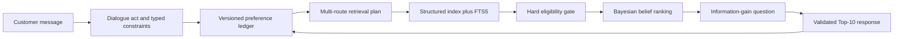
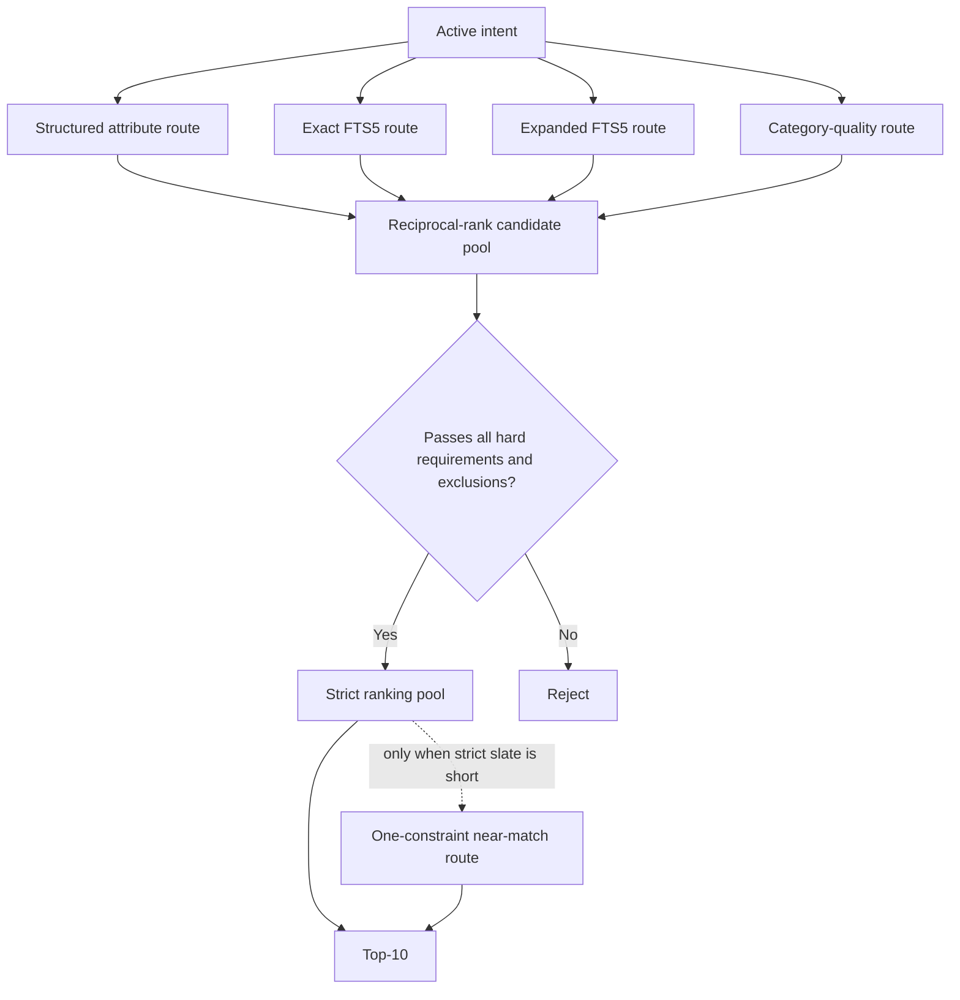
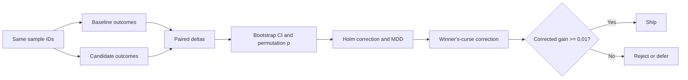

# Search That Remembers: full Devpost video script

This is the word-for-word presenter script for the PowerPoint-style Devpost video.
It expands the shorter [storyboard](devpost_video_storyboard.md) into a complete
recording reference. The timed cut is about 4 minutes 55 seconds, including the
terminal demo. For that cut, read the **Core narration**, **Transition**, and demo
narration sections. The **Optional detail** paragraphs are reference material for a
longer cut or judge questions; reading every optional paragraph would make the video
about nine minutes. If the submission portal imposes a three-minute cap, omit the
transitions and use the shorter storyboard instead.

Use one visual system throughout:

- Put the plain-language idea in the upper two thirds of each slide.
- Put exact methods, technology names, and numbers in a narrow technical strip at
  the bottom.
- Keep the BM25 comparison in the same footer position on every slide.
- Animate diagrams one step at a time in the order described below.
- End on the terminal result. Do not add a thank-you slide after the demo.

Team credit for the title slide: **Cervon, Samuel, and Weichu**.

## Slide 1: Search That Remembers

**Time:** 0:00-0:12

### Main slide text

**SEARCH THAT REMEMBERS**

One conversation. One changing intent. Better products at every turn.

Deterministic. Offline. Auditable.

`Cervon | Samuel | Weichu`

### Technical strip

`50,000 products | CPU only | 0 runtime API calls | 0 tokens | no GPU | no credentials`

### BM25 footer

`Starter BM25: latest message only | Our agent: persistent, versioned shopping intent`

### Visual and animation

Split the slide vertically without putting either side in a card. On the left,
show three customer messages entering a search box and disappearing. Label it
`Starter BM25`. On the right, feed the same messages into a visible intent ledger
whose rows remain on screen. Label it `Our agent`.

Animate the title first, then the two paths, then the technical strip.

### Core narration

"We built Search That Remembers, a conversational shopping agent by Cervon,
Samuel, and Weichu. It follows a shopper's changing request across multiple turns
and returns ranked products from a 50,000-item catalog. The whole inference path
runs locally on a CPU, with no API calls, credentials, model server, or GPU."

### Optional detail

"The default starter gave us a useful BM25 search baseline, but it sees only the
latest message. Our system keeps a typed, versioned record of what the shopper
wants, what they rejected, and what they changed their mind about. That is the
difference behind every slide in this demo."

### Transition

"Here is why that memory matters."

## Slide 2: The End of Forgetful Search

**Time:** 0:12-0:30

### Main slide text

**THE END OF FORGETFUL SEARCH**

A shopper says:

1. "I need boots."
2. "Keep it under 80 dollars."
3. "Not leather."
4. "Actually, make that hiking shoes."

The shopper experiences one conversation. A stateless search engine sees four
unrelated queries.

### Technical strip

`Starter: SQLite FTS5 BM25 | latest-message OR query | ask_attribute=null | lexical Top-10`

`Starter public result: HR@10 0.125 | MRR 0.068034 | MTTC 9.81 | TechnicalScore 0.10671`

### BM25 footer

`Improvement over BM25: memory, correction, exclusion semantics, and clarification`

### Visual and animation

Show the four speech bubbles in sequence. Under the starter path, draw four
disconnected arrows to four different Top-10 lists. Under our path, draw one line
through all four bubbles and update an intent summary after each message:

```text
category=boots
+ max_price=80
+ excluded_material=leather
replace category: boots -> hiking shoes
```

### Core narration

"Shopping requests build over time. A person starts with boots, adds a budget,
rejects leather, and then changes category. The starter sends each message
straight into BM25, so the earlier constraints disappear."

### Optional detail

"BM25 still contributes useful lexical relevance, and we keep that evidence. But
the default path cannot tell a preference from a requirement, or the word
'leather' from the instruction 'not leather.' It also cannot preserve a budget or
retract an old choice. We treat the conversation itself as part of retrieval."

### Transition

"That requires a pipeline with explicit responsibilities."

## Slide 3: The Architecture of Intent

**Time:** 0:30-0:53

### Main slide text

**THE ARCHITECTURE OF INTENT**

Understand the change. Update memory. Search broadly. Enforce requirements. Rank
the survivors. Ask only when the answer will help.

### Technical strip

`DialogueAct -> ConstraintExtractor -> PreferenceLedger -> SearchPlanner -> SQLite`

`-> EligibilityGate -> CandidateBeliefModel -> QuestionPolicy -> ResponseValidator`

`7 typed trace events/turn: interpretation | retrieval | constraint | belief | question | slate | runtime`

### BM25 footer

`Improvement over BM25: interpretation, eligibility, ranking, and dialogue are separate stages`

### Diagram

Build this flow from left to right, one node per sentence of narration:



Use a loop arrow from the response back to the preference ledger. That loop is the
main visual distinction from one-shot search.

### Core narration

"Every turn passes through the same explainable pipeline. We classify what changed,
extract typed constraints, update a versioned preference ledger, retrieve candidates,
remove ineligible products, rank the rest, and decide whether a clarification would
reduce uncertainty."

### Optional detail

"The response is validated against the organizer contract before it leaves the
agent. Each stage emits a typed trace event, so we can inspect why a constraint was
added, why a product survived, and why a question was selected. The starter jumps
from message tokens directly to a BM25 Top-10. We keep BM25 inside a larger,
auditable decision process."

### Transition

"The first stage that changes the shopping experience is memory."

## Slide 4: The Marketplace Memory

**Time:** 0:53-1:15

### Main slide text

**THE MARKETPLACE MEMORY**

The agent remembers meaning, not a transcript.

"Must have," "I prefer," "not," "ignore that," and "no preference" cause
different state changes.

### Technical strip

`PreferenceConstraint(attribute, value, strength, excluded, confidence, operator)`

`HARD >= 0.90 | SOFT evidence | scoped negation | SET | REMOVE | DECLINE | RETRACT_PROVISIONAL`

`intent_version increments on a genuine override`

### BM25 footer

`Improvement over BM25: "leather", "prefer leather", and "not leather" are different instructions`

### Diagram


Color only the changed row. Do not replace the whole ledger between steps; the
audience should see which state survives.

### Core narration

"We store typed constraints instead of concatenating chat text. In this example,
the correction removes red, keeps boots, adds leather, and increments the intent
version."

### Optional detail

"Strength and exclusion stay symbolic. A hard requirement must pass the eligibility
gate. A soft preference contributes evidence to ranking. A declined attribute is
remembered so the agent does not ask it again. Most importantly, negation is never
converted into weak positive evidence. BM25 can match the token 'leather'; our
ledger knows whether leather is wanted or forbidden."

### Transition

"Once the intent is explicit, retrieval can use more than one route."

## Slide 5: The Retrieval Conductor and Constraint Firewall

**Time:** 1:15-1:40

### Main slide text

**THE RETRIEVAL CONDUCTOR**

One route finds exact facts. Another finds relevant language. A firewall removes
anything that breaks the shopper's hard requirements.

### Technical strip

`Routes: metadata 1.40 | exact FTS 1.20 | expanded FTS 0.80 | category-quality 0.25 | counterfactual 0.15`

`Reciprocal Rank Fusion k=60 | <=1,000 hits/route | <=5,000 materialized candidates`

`FTS5 weights: title 6.0 | categories 4.0 | feature 2.5 | details 2.5 | store 1.5 | description 1.0`

### BM25 footer

`Improvement over BM25: lexical relevance is fused with structure, then every hard constraint is checked`

### Diagram



Animate the routes in parallel, merge them, and then light the eligibility gate.
Show rejected products falling away before ranking.

### Core narration

"One search route is not enough for a messy catalog. Structured metadata handles
exact facts. FTS5 handles words and phrases. Reciprocal Rank Fusion combines the
routes, and a hard eligibility gate removes products that violate required or
excluded attributes."

### Optional detail

"The starter trusts one OR-based BM25 order. We use BM25-style relevance as one
signal, cap every route for predictable CPU cost, and materialize at most 5,000
candidates. If the strict slate is short, the agent may add a controlled
one-constraint near match. Explicit exclusions are never relaxed."

### Transition

"The eligible products still need a stable, explainable order."

## Slide 6: The Evidence Engine

**Time:** 1:40-2:02

### Main slide text

**THE EVIDENCE ENGINE**

Every rank has a reason. Every question has a measured purpose.

The agent shows useful products now and asks about the attribute that would reduce
uncertainty most.

### Technical strip

`Ranking: Bayesian log contributions | route evidence | soft-match likelihoods | profile grounding`

`stable softmax | parent_asin tie-break | posterior entropy | expected conditional entropy`

`information gain | population cap 64 | up to 10 recommendations while asking`

### BM25 footer

`Improvement over BM25: contribution-level evidence plus an information-gain question policy`

### Visual and animation

On the left, show three products with stacked horizontal bars labeled `route`,
`soft preference`, and `aggregate profile`. On the right, show three candidate
questions with different entropy-reduction bars. Highlight the largest reduction.

### Core narration

"The ranker combines named evidence terms into a posterior score and breaks exact
ties with `parent_asin`, so the same input always produces the same order."

### Optional detail

"The question policy measures posterior entropy across the eligible population. It
asks about the attribute with the highest expected information gain, remembers a
decline, and rotates already-shown items within the same intent version. Unlike the
starter, the agent does not return a silent BM25 list. It can explain the evidence
and keep recommending while it asks."

### Transition

"We apply the same discipline to deciding whether an experiment is worth shipping."

## Slide 7: Proof Before Promotion

**Time:** 2:02-2:27

### Main slide text

**PROOF BEFORE PROMOTION**

A higher number is not automatically a better system.

We test the same sessions in pairs, account for noise and multiple comparisons,
and require a practical gain before shipping a candidate.

### Technical strip

`paired nonparametric bootstrap | paired permutation test | Holm-Bonferroni | MDD`

`winner's-curse correction | Phipson-Smyth p-value floor | R=10,000`

`TechnicalScore = 0.50*HR@10 + 0.30*MRR + 0.20*clip((11-MTTC)/10)`

`Ship bar: corrected delta TechnicalScore >= 0.01 with no unpaid HR@10 loss`

### BM25 footer

`Improvement over BM25 is measured on the same frozen sessions, not inferred from a prettier demo`

### Diagram



### Core narration

"The public set has only 200 sessions, so small movements can be noise. We compare
candidate and baseline outcomes on the same sample IDs with paired bootstrap and
permutation tests."

### Optional detail

"We also use Holm correction, minimum detectable difference, and a winner's-curse
correction for selecting the best experiment. A candidate must clear a corrected
TechnicalScore gain of 0.01 and cannot trade away recall without enough MRR or
turn-efficiency benefit. The organizer's BM25 result remains the frozen external
reference, while our internal changes face this stricter gate."

### Transition

"With that context, these are the measured public-set results."

## Slide 8: A 7.36x Leap Over the Starter

**Time:** 2:27-2:52

### Main slide text

**A 7.36x LEAP OVER THE STARTER**

| Public-set metric | Starter BM25 | Our agent | Improvement |
| --- | ---: | ---: | ---: |
| Hit Rate@10 | 12.5% | 92.0% | +79.5 points; +636%; 7.36x |
| MRR | 0.068034 | 0.524466 | +670.89%; 7.71x |
| MTTC | 9.81 turns | 3.425 turns | 6.385 turns sooner; 65.09% lower |
| TechnicalScore | 0.10671 | 0.76884 | +620.49%; 7.21x |

`184/200 targets found | Starter: 25/200 | 159 additional successful sessions`

### Technical strip

`Scenario HR@10: Boundary 0.90 | Browsing 0.95 | Buying 0.90 | Intent Override 0.90`

`Efficiency 0.7575 | prompt tokens 0 | completion tokens 0`

### BM25 footer

`Improvement over BM25: same 200-session public evaluator; private evaluation remains the generalization test`

### Visual and animation

Use paired horizontal bars for HR@10, MRR, and TechnicalScore. Use a separate
left-pointing bar for MTTC and label it `lower is better`. Keep raw values printed
beside every bar. Finish with a counter that changes from `25` to `184` successful
sessions.

### Core narration

"On the unchanged 200-session public evaluator, Hit Rate at 10 rises from 12.5 to
92 percent. That is 159 additional successful sessions and a 7.36-times result
over the starter."

### Optional detail

"Mean reciprocal rank improves by 670.89 percent, so correct products appear much
closer to the top. Mean turns to first correct drops from 9.81 to 3.425, a 65.09
percent reduction. The combined TechnicalScore rises from 0.10671 to 0.76884, or
620.49 percent. These are descriptive public-set results. We do not claim they
guarantee the private score."

### Transition

"The gains came from specific fixes, not from adding a large online model."

## Slide 9: The Fixes That Moved the Needle

**Time:** 2:52-3:15

### Main slide text

**THE FIXES THAT MOVED THE NEEDLE**

Catalog structure and conversation state produced the largest gains.

- Attribute classification, material recovery, and override retention:
  `0.760 -> 0.915 HR@10`
- Separator normalization: `0.915 -> 0.920 HR@10`
- One corrected catalog concept moved its target from `rank 154 -> rank 1`
- Intent Override improved from `0.20 -> 0.90 HR@10`, a 70-point gain

### Technical strip

`document-frequency attribute classification | catalog-derived material vocabulary`

`soft-retain on override | NFKC + casefold + separator match_key`

`131 concepts / 705 products had inconsistent colon spacing`

`SQL EXISTS/NOT EXISTS 263-293 ms -> posting-set IN/NOT IN 3-7 ms`

### BM25 footer

`Improvement over BM25: normalize catalog concepts once and preserve valid intent across corrections`

### Visual and animation

Show a staircase from `0.760` to `0.915` to `0.920`. Beside it, merge
`material: alloy` and `material:alloy` into one normalized concept. End with a
small timing bar that shrinks from roughly `280 ms` to roughly `5 ms`.

### Core narration

"The largest jump came from classifying attributes, recovering catalog materials,
and retaining compatible intent during an override. Hit Rate at 10 moved from
0.760 to 0.915."

### Optional detail

"A separator-normalization fix then moved it to 0.920. The catalog used inconsistent
colon spacing across 131 concepts and 705 products; one affected target moved from
rank 154 to rank one. We also replaced slow correlated SQL filters with posting
sets, cutting that path from 263 to 293 milliseconds down to 3 to 7 milliseconds.
The starter indexes raw text once. We build reusable structure around its lexical
foundation."

### Transition

"Several reasonable ideas did not earn a place in the shipped path."

## Slide 10: Experiments We Refused to Oversell

**Time:** 3:15-3:38

### Main slide text

**EXPERIMENTS WE REFUSED TO OVERSELL**

- Always-on tail exploration changed zero outcomes.
- A popularity tie-break changed nothing because route evidence already separated
  the candidates.
- Keyed-feature recovery produced zero public gain; it remains only as a catalog
  correctness measure for possible private cases.
- Per-value regular-expression matching exceeded two minutes; precomputed indexes
  replaced it.

### Technical strip

`Forced TF-IDF fallback: delta TS +0.006110 | 95% CI [-0.018892, 0.031311]`

`permutation p=0.645335 | Holm p=1.0 | MDD=0.035987 | verdict: not detectable`

`Tail-only ablation: delta=0 | CI [0,0] | p=1.0 | byte-identical 200-session outcomes`

### BM25 footer

`Improvement over BM25 does not mean more retrieval machinery always helps; measured nulls are kept as nulls`

### Visual and animation

Build a funnel with `Idea`, `Same-session test`, `Statistical gate`, and
`Ship / Reject / Defer`. Place tail exploration and popularity under `Reject`,
forced TF-IDF under `Not detectable`, and keyed recovery under
`Correctness only`.

### Core narration

"We kept the failed experiments in the record. Always-on exploration and a
popularity tie-break changed no outcomes. A regular-expression approach was far
too slow."

### Optional detail

"The forced TF-IDF fallback appeared 0.006110 higher in TechnicalScore, but the
confidence interval crossed zero, the Holm-adjusted p-value was one, and the
minimum detectable difference was much larger than the observed movement. We call
that result 'not detectable,' not a win. Improving on starter BM25 meant testing
ideas and keeping only what produced reproducible value or necessary catalog
correctness."

### Transition

"That same standard applies to the conversation itself."

## Slide 11: Test the Conversation, Not Just the Function

**Time:** 3:38-4:02

### Main slide text

**TEST THE CONVERSATION**

| Test | Conversation | Expected proof |
| --- | --- | --- |
| Memory | "boots" -> "black leather" | Later results honor accumulated intent |
| Override | "red boots" -> "ignore that; leather boots" | Red retracts; boots stay; leather activates |
| Exclusion | "boots, but not leather" | No leather result; exclusion is never relaxed |
| Boundary | question -> "no preference" | Record a decline and do not repeat the question |

### Technical strip

`745 unittest cases | ~10 seconds | evaluator byte-integrity test | deterministic artifact build`

`stable fallback order | typed turn-history cap | organizer response-contract validation`

### BM25 footer

`Improvement over BM25 is tested as state transitions, constraint safety, stable ranking, and contract compliance`

### Test flow diagram


### Core narration

"The suite has 745 tests, but the important cases are conversations. We test
accumulated preferences, intent replacement, exclusions that can never be relaxed,
and 'no preference' replies that must become declines rather than fake values."

### Optional detail

"The suite also protects the unchanged evaluator, the Top-10 contract, artifact
determinism, stable fallback order, bounded history, and the statistical rig. The
starter proves lexical retrieval. Our tests prove that a multi-turn state change
leads to the right eligibility and ranking change, and that running the same case
again produces the same answer."

### Transition

"The deadline also left planned work unfinished, and we want to show that boundary
clearly."

## Slide 12: The Unfinished Frontier

**Time:** 4:02-4:28

### Main slide text

**THE UNFINISHED FRONTIER**

These GSD phases are TODO because the submission deadline arrived first. They are
plans, not shipped claims.

| GSD phase | Status | Remaining work |
| --- | --- | --- |
| Phase 2: Expanded Dataset and Paraphrase Probe | `11/14, in progress` | Publish the 300-pair probe and 100-pair cross-check, build two expanded corpora, run four baselines, and produce paired contrasts |
| Phase 3: Ranking Precision and Conversational Efficiency | `0/TBD` | Test bounded slate feedback, frozen linear reranking, normalized fusion, and confidence-based commitment |
| Phase 4: Semantic Asset and Candidate Spikes | `0/TBD` | Audit a frozen synonym asset; measure ONNX reranking and runtime LLM extraction with an offline fallback |
| Phase 5: Go/No-Go Checkpoint | `0/TBD` | Decide whether corrected marginal gain justifies more score iteration or whether effort moves to the rest of the rubric |
| Phase 6: Submission Hardening | `0/TBD` | Add lazy artifact build, bounded 800-session memory, soft deadlines, blocked-network proof, `requirements.txt`, and artifact-size evidence |
| Phase 7: Innovation and Impact Narrative | `0/TBD` | Finish evidence-backed Innovation and Impact reports after the paraphrase result is frozen |
| Phase 8: Deliverables and Submission | `0/TBD` | Run clean-environment reproduction, finish video and links, package turn history, complete disclosures, and perform the final audit |

### Technical strip

`Completed: Phase 1 | 15/15 plans | 10/10 verification checks`

`Deferred to v2: SPLADE weights | dense ONNX retrieval | deeper profile prior | soft price proximity | live pitch prep`

### BM25 footer

`Every TODO candidate must beat both the retained deterministic agent and the frozen starter BM25 reference`

### Visual and animation

Use a horizontal eight-phase roadmap. Fill Phase 1 completely. Fill Phase 2 to
`11/14` and place a visible `TODO` label on its unfinished section. Outline Phases
3 through 8 and label each `TODO`. Do not use completion checkmarks for partial or
unstarted phases.

### Core narration

"We are explicit about what did not fit before the deadline. Phase 1, the
measurement rig, is complete. Phase 2 is 11 of 14 plans complete. The final probe
publication and every phase from three through eight remain TODO."

### Optional detail

"Those phases cover ranking experiments, semantic spikes, the go-or-stop decision,
failure hardening, the final rubric narratives, and clean submission packaging.
We also deferred SPLADE weights, dense ONNX retrieval, a deeper profile prior, soft
price scoring, and live-pitch preparation to version two. None of this unfinished
work is included in the reported 0.920 score. Every future candidate still has to
beat our retained agent and the starter BM25 reference under the same statistical
gate."

### Transition

"I will finish with the behavior this system was built for: a shopper changing
their mind."

## Slide 13: Demo - Intent Changes, Ranking Changes

**Time:** 4:28-4:55

This slide becomes a terminal recording. Do not return to PowerPoint afterward.

### Main slide text before switching to the terminal

**DEMO: INTENT CHANGES, RANKING CHANGES**

`public_0003 | Intent Override | target B09YMTWDXJ`

`Expected target movement: rank 2 -> outside Top-10 -> rank 1`

### Technical strip

`Casio AQ-800E-7A | first_hit_turn=3 | reciprocal_rank=1.0`

### BM25 footer

`Starter BM25 sees another bag of words; our ledger retracts stale intent and reranks the same catalog`

### Preparation before recording

Build the artifact before recording. Do not include the 60-to-90-second build in
the video:

```powershell
uv run python -m starter.shopping_agent.build_catalog_artifacts --catalog data/catalog.jsonl --output data/catalog.artifacts
```

Enlarge the terminal font, clear the terminal, and record this command:

```powershell
uv run python -m experiments.demo_session --sample-id public_0003
```

The demo helper uses the public label only to display the target rank and the final
`HIT` marker. The `Agent` receives the same aggregate profile and customer messages
as it receives from the unchanged evaluator.

### What should appear

1. Scenario: `intent_override`.
2. Target: `B09YMTWDXJ`, Casio men's wrist watch AQ-800E-7A.
3. Turn 1 customer request: `I'm looking for Watches Wrist Watches. Stainless Steel Band`
4. Target rank on turn 1: `2`, but the target intent is not active yet.
5. Target outside the Top 10 on turn 2.
6. Turn 3 override: `Actually, ignore my earlier preference. What I need is: Water Resistant.`
7. Final verified output: `RESULT: HIT on turn 3 at rank 1`.

### Narration while the command runs

"This is a released Intent Override session, run through the real agent and the
organizer's turn policy. The shopper first asks for a wristwatch with a stainless
steel band. The target is visible at rank two, but that is not yet the active
hidden intent, so the evaluator correctly does not count it as a hit."

Pause while turn 2 prints.

"After the next exchange, the target leaves the Top 10. Now the shopper overrides
the earlier preference and asks for water resistance."

Pause while turn 3 prints.

"The preference ledger retracts the stale constraint, preserves the compatible
watch context, and reranks the catalog. The target returns at rank one. The final
result is a hit on turn three at rank one. That is Search That Remembers."

Stop recording with this line still visible:

```text
RESULT: HIT on turn 3 at rank 1
```

## Recording checks

Before uploading the video:

- Keep the project name visible on Slide 1 for at least three seconds.
- Read raw metric values as well as percentage improvements.
- Say "public set" when discussing the 0.920 result and do not imply a private-set
  result.
- Keep the BM25 footer visible on every PowerPoint slide.
- Show `TODO` on every unfinished GSD phase.
- Confirm the terminal command ends at `HIT on turn 3 at rank 1` before recording.
- Use only original, licensed, or permitted visual assets.
- Upload to YouTube with public visibility and link it in the Devpost description.
