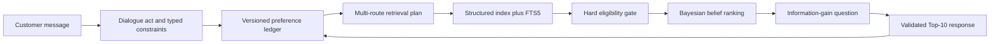
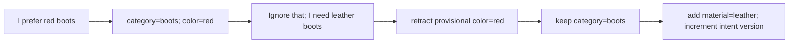
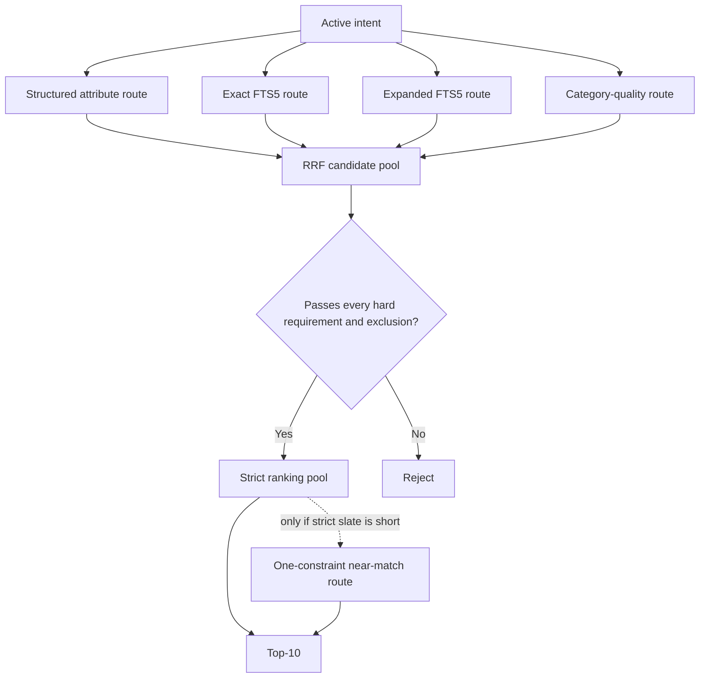
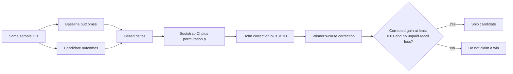
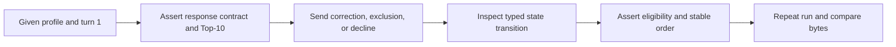
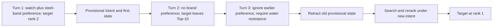

# Devpost demo video storyboard

This is a reference for a PowerPoint-style YouTube video. The core cut is 13 slides and approximately 2 minutes 45 seconds. Keep the large text readable, put exact methods and numbers in a narrow strip along the bottom, and use the same small BM25 comparison footer on every slide.

Do not add a closing slide after the demo. End on the live `RESULT: HIT on turn 3 at rank 1` output so the last thing the judges see is the agent working.

## Slide 1 - Search That Remembers (0:00-0:05)

### Large on-screen copy

**SEARCH THAT REMEMBERS**

From one-shot keywords to a conversation that can change its mind.

Deterministic. Offline. Auditable.

### Bottom technical strip

`50,000 products | CPU only | 0 runtime API calls | 0 tokens | no GPU | no credentials`

### BM25 comparison footer

The default starter searches only the latest message. Our agent carries the shopper's intent across turns.

### Diagram idea

Show a search box on the left dropping each previous message. On the right, show three messages flowing into one persistent intent ledger. Use product thumbnails only if they come from permitted assets; otherwise use simple text rows with `parent_asin` labels.

### Voiceover

"We built Search That Remembers: a local shopping agent that follows a changing request instead of treating every sentence as a brand-new search."

## Slide 2 - The End of Forgetful Search (0:05-0:15)

### Large on-screen copy

A shopper starts broad, adds a budget, rejects leather, and then changes direction.

A stateless search engine sees four separate queries. The shopper experiences one conversation.

### Bottom technical strip

Default starter: `stateless SQLite FTS5 BM25 | OR over latest-message terms | ask_attribute = null | Top-10 lexical rows`

Public baseline: `Hit Rate@10 0.125 | MRR 0.068034 | MTTC 9.81 | TechnicalScore 0.10671`

### BM25 comparison footer

BM25 supplies useful lexical evidence, but the starter has no constraint memory, correction model, exclusion semantics, or clarification policy.

### Diagram idea

Use four speech bubbles: "boots" -> "under $80" -> "not leather" -> "actually, hiking shoes." Under BM25, draw four disconnected arrows. Under our system, draw one state line that updates at every turn.

### Voiceover

"The starter is a solid lexical baseline, but it forgets everything except the latest sentence. Shopping does not work that way. Requirements accumulate, conflict, and sometimes get replaced."

## Slide 3 - The Architecture of Intent (0:15-0:29)

### Large on-screen copy

Every message passes through one explainable pipeline.

First understand the change. Then search. Then enforce. Then rank. Then decide what to ask next.

### Bottom technical strip

`DialogueAct -> ConstraintExtractor -> PreferenceLedger -> SearchPlanner -> SQLite -> EligibilityGate -> CandidateBeliefModel -> QuestionPolicy -> ResponseValidator`

Seven typed trace events per turn: `interpretation, retrieval, constraint, belief, question, slate, runtime`

### BM25 comparison footer

The starter jumps directly from message tokens to BM25 Top-10; our pipeline separates interpretation, eligibility, ranking, and dialogue.

### Flow diagram



### Voiceover

"The architecture is deliberately layered. We interpret the turn, update a versioned intent, retrieve through several routes, enforce hard constraints, rank the eligible products, and choose the most useful next question."

## Slide 4 - The Memory of the Marketplace (0:29-0:41)

### Large on-screen copy

The agent remembers meaning, not just words.

"Must have," "I prefer," "not," "ignore that," and "no preference" cause different state changes.

### Bottom technical strip

`PreferenceConstraint(attribute, value, strength, excluded, confidence, operator)`

`HARD >= 0.90 | SOFT evidence | scoped negation | SET / REMOVE / DECLINE / RETRACT_PROVISIONAL | intent_version`

### BM25 comparison footer

BM25 can match "leather" but cannot distinguish required leather, preferred leather, and "not leather."

### State-flow diagram



### Voiceover

"We store typed constraints instead of concatenating chat text. A correction retracts the conflicting value, preserves compatible context, and starts a new intent version. Negation stays symbolic, so 'not leather' can never become weak positive evidence for leather."

## Slide 5 - The Retrieval Conductor and Constraint Firewall (0:41-0:54)

### Large on-screen copy

One search route is not enough.

Structured facts find exact matches. Full-text search finds relevant language. A hard gate removes anything that breaks the shopper's requirements.

### Bottom technical strip

Routes: `metadata 1.40 | exact FTS 1.20 | expanded FTS 0.80 | category-quality 0.25 | counterfactual 0.15`

Fusion: `Reciprocal Rank Fusion, k=60 | <=1,000 hits/route | <=5,000 materialized candidates`

FTS5 fields: `title 6.0 | categories 4.0 | feature 2.5 | details 2.5 | store 1.5 | description 1.0`

### BM25 comparison footer

The starter runs one OR-based BM25 query and trusts its order; our system fuses independent evidence and re-checks every hard constraint.

### Candidate-flow diagram



### Voiceover

"We keep BM25-style lexical relevance, but it becomes one signal rather than the whole system. Structured routes protect recall, reciprocal-rank fusion combines evidence, and the constraint firewall removes products that violate hard requirements. Explicit exclusions are never relaxed."

## Slide 6 - The Evidence Engine (0:54-1:07)

### Large on-screen copy

Every rank has a reason. Every question has a measured purpose.

The agent scores what it knows, then asks about the attribute that would reduce uncertainty the most, while still showing products now.

### Bottom technical strip

Ranking: `Bayesian log contributions | route evidence | soft-match likelihoods | aggregate-profile grounding | stable softmax | parent_asin tie-break`

Clarification: `posterior entropy | expected conditional entropy | information gain | population cap 64`

Behavior: `up to 10 recommendations while asking | declined attributes not repeated | prior slate rotated within intent version`

### BM25 comparison footer

BM25 emits a relevance order and no question; our ranker records contribution-level evidence and uses posterior uncertainty to choose the next question.

### Diagram idea

Draw three ranked products with stacked contribution bars labeled `route`, `soft material`, and `profile`. To the right, show three possible questions with entropy-reduction bars; highlight the largest information gain.

### Voiceover

"The ranker combines named evidence terms into a posterior and breaks exact ties with the product identifier. The question policy looks at the eligible population and asks what would reduce uncertainty most. It never withholds the current recommendations just to ask a question."

## Slide 7 - Proof Before Promotion (1:07-1:22)

### Large on-screen copy

We do not call a small metric movement a win just because it looks higher.

Every candidate must beat noise, multiple comparisons, practical significance, and the cost of selecting the best experiment.

### Bottom technical strip

`paired nonparametric bootstrap | paired permutation test | Holm-Bonferroni | minimum detectable difference`

`winner's-curse order-statistic correction | Phipson-Smyth p-value floor | R=10,000 | corrected delta TechnicalScore >= 0.01`

Score: `0.50*HitRate@10 + 0.30*MRR + 0.20*clip((11-MTTC)/10)`

### BM25 comparison footer

The organizer BM25 score is the frozen reference; changes inside our system are compared on the same sessions with paired statistics and fingerprinted configurations.

### Measurement-flow diagram



### Voiceover

"The public set is only 200 sessions, so raw leaderboards can fool us. We use paired bootstrap and permutation tests, Holm correction, minimum detectable difference, and a winner's-curse correction. A candidate needs a corrected TechnicalScore gain of at least 0.01 before we call it a win."

## Slide 8 - A 7.36x Leap Over the Starter (1:22-1:37)

### Large on-screen copy

| Public-set metric | Starter BM25 | Our agent | Improvement |
| --- | ---: | ---: | ---: |
| Hit Rate@10 | 12.5% | 92.0% | +79.5 percentage points; +636%; 7.36x |
| MRR | 0.068034 | 0.524466 | +670.89%; 7.71x |
| MTTC | 9.81 turns | 3.425 turns | 6.385 turns sooner; 65.09% reduction |
| TechnicalScore | 0.10671 | 0.76884 | +620.49%; 7.21x |

The agent finds 184 of 200 targets. The starter finds 25. That is 159 additional successful sessions.

### Bottom technical strip

Scenario Hit Rate@10: `Boundary 0.90 | Browsing 0.95 | Buying 0.90 | Intent Override 0.90`

Retained agent: `Efficiency 0.7575 | 0 prompt tokens | 0 completion tokens`

### BM25 comparison footer

These are descriptive improvements over the organizer's published starter on the same 200-session public set; private evaluation remains the generalization test.

### Diagram idea

Use four horizontal before/after bars with the exact values printed at their ends. For MTTC, reverse the visual direction or label it clearly as "lower is better." Do not use a generic percentage infographic that hides the raw values.

### Voiceover

"Against the organizer's starter, Hit Rate@10 rises from 12.5 to 92 percent: 159 more successful sessions. Mean reciprocal rank improves by 671 percent, and the first hit arrives 65 percent sooner. The combined TechnicalScore rises from 0.10671 to 0.76884."

## Slide 9 - The Fixes That Moved the Needle (1:37-1:49)

### Large on-screen copy

The largest gains came from understanding catalog structure and conversation state, not from adding a larger model.

- Attribute classification, material recovery, and override retention: `0.760 -> 0.915` Hit Rate@10.
- Separator normalization: `0.915 -> 0.920`; one target moved from rank `154 -> 1`.
- Intent Override: `0.20 -> 0.90`, a 70-point gain.

### Bottom technical strip

`document-frequency attribute classification | catalog-derived material vocabulary | soft-retain on override | NFKC + casefold + separator match_key`

Catalog defect repaired: `131 concepts across 705 products` used inconsistent colon spacing.

SQL filter rewrite: correlated `EXISTS/NOT EXISTS 263-293 ms` -> posting-set `IN/NOT IN 3-7 ms`.

### BM25 comparison footer

The starter indexes raw text once; our build extracts reusable structure and our dialogue layer prevents a valid retrieval from being rejected by stale intent.

### Diagram idea

Use a three-step staircase labeled `0.760`, `0.915`, and `0.920`. Beside it, show `material: alloy` and `material:alloy` merging into one normalized concept.

### Voiceover

"The big improvement was not a black-box model. It was fixing how the system understands attributes, recovers materials, and handles overrides. One normalization bug alone moved a target from rank 154 to rank one."

## Slide 10 - Experiments We Refused to Oversell (1:49-2:01)

### Large on-screen copy

Some ideas sounded useful and measured as useless, uncertain, or too expensive.

- Always-on tail exploration changed zero outcomes; the retained policy runs it only as a last resort.
- A popularity tie-break changed nothing because route evidence already separated the candidates.
- Keyed-feature recovery produced zero public gain; we retained it only for catalog correctness and private-set robustness.
- Per-value regular-expression matching exceeded two minutes; precomputed indexes replaced it.

### Bottom technical strip

Forced TF-IDF fallback vs auto FTS: `observed delta TechnicalScore +0.006110 | 95% CI [-0.018892, 0.031311] | permutation p=0.645335 | Holm p=1.0 | MDD=0.035987 | verdict=not detectable`

Tail-only ablation: `delta=0 | CI [0,0] | p=1.0 | byte-identical 200-session outcomes`

### BM25 comparison footer

Improving on BM25 did not mean accepting every extra retrieval idea; only measured, reproducible gains belonged in the shipped path.

### Diagram idea

Use a laboratory funnel: `Idea -> Same-session test -> Statistical gate -> Ship / Reject / Defer`. Put tail exploration and popularity tie-break in Reject, forced fallback in Uncertain, and keyed recovery in Correctness-only.

### Voiceover

"We also kept the failures. More exploration produced no difference. Popularity did not break real ties. The fallback engine looked slightly higher, but its confidence interval crossed zero and the experiment could not resolve the difference. We report that as not detectable, not as a win."

## Slide 11 - Test the Conversation, Not Just the Function (2:01-2:13)

### Large on-screen copy

| Test case | Conversation | Expected proof |
| --- | --- | --- |
| Memory | "boots" -> "black leather" | Both turns return 10 unique items; later results satisfy accumulated intent. |
| Override | "red boots" -> "ignore that; leather boots" | Red retracts, boots remain, leather becomes active. |
| Exclusion | "boots, but not leather" | No leather recommendation appears; exclusion is never relaxed. |
| Boundary | question -> "no preference" | The reply becomes a decline, not a fake value, and the question is not repeated. |

### Bottom technical strip

Current verification: `745 unittest cases | approximately 10 seconds | evaluator byte-integrity test | deterministic artifact build | repeated fallback order test | typed turn-history cap`

Named proofs: `test_generic_override_retracts_color_but_preserves_boot_category | test_exclusion_is_never_relaxed_even_with_zero_strict | test_declined_question_is_not_repeated`

### BM25 comparison footer

The starter tests lexical retrieval. Our suite tests state transitions, constraint safety, deterministic ordering, failure paths, statistics, and the organizer contract.

### Test-flow diagram



### Voiceover

"The suite has 745 tests. The important cases are conversational: accumulated preferences, corrected intent, exclusions that can never be relaxed, and boundaries where 'no preference' must not become a product attribute."

## Slide 12 - The Unfinished Frontier: Time-Boxed, Not Hidden (2:13-2:23)

### Large on-screen copy

These GSD phases remain TODO because the submission deadline arrived first. They are plans, not shipped claims.

| GSD phase | Honest status and TODO |
| --- | --- |
| Phase 2 - Paraphrase probe | `11/14` primary plans; detached-authoring support is complete, but the 300-pair probe plus 100-pair cross-check, two expanded corpora, four baselines, and paired contrasts remain. |
| Phase 3 - Ranking and efficiency | `0/TBD`; test bounded slate feedback, frozen linear reranking, normalized fusion, and confidence-based commitment. |
| Phase 4 - Semantic spikes | `0/TBD`; audit a frozen synonym asset, then measure ONNX reranking and runtime LLM extraction with offline fallback. |
| Phase 5 - Go/no-go | `0/TBD`; stop or continue using winner's-curse-corrected marginal gain around `0.005` TechnicalScore. |
| Phase 6 - Hardening | `0/TBD`; lazy artifact build, bounded 800-session memory, soft deadlines, blocked-network proof, and artifact-size justification. |
| Phase 7 - Narrative | `0/TBD`; finish evidence-backed Innovation and Impact reports after the paraphrase probe. |
| Phase 8 - Submission | `0/TBD`; clean-environment reproduction, public video/link, packaged turn history, disclosures, and final audit. |

### Bottom technical strip

Completed foundation: `Phase 1, 15/15 plans, statistics rig verified 10/10`.

Still deferred to v2: `SPLADE term weights | dense ONNX retrieval | deeper profile prior | soft price proximity | live pitch preparation`.

### BM25 comparison footer

Every future candidate must still beat the deterministic agent and the organizer BM25 reference; no unfinished phase is included in the reported 0.920 score.

### Diagram idea

Use a horizontal roadmap with Phase 1 filled, Phase 2 partially filled, and Phases 3-8 outlined. Put a visible `TODO` label above every unfinished phase. Avoid green checkmarks on partially complete work.

### Voiceover

"We are also explicit about what did not fit before the deadline. The measurement foundation is complete, the paraphrase probe is partially built, and Phases three through eight remain TODO. None of that unfinished work is included in the score we just showed."

## Slide 13 - Demo: Intent Changes, the Ranking Changes (2:23-2:45)

This final slide becomes a terminal screen recording. Do not return to PowerPoint afterward.

### Preparation before recording

Build the catalog artifact once. Do not include the 60-90 second build in the video:

```powershell
uv run python -m starter.shopping_agent.build_catalog_artifacts --catalog data/catalog.jsonl --output data/catalog.artifacts
```

Then enlarge the terminal text and record this command:

```powershell
uv run python -m experiments.demo_session --sample-id public_0003
```

The runner is presentation-only. It uses the public label to mark the result after each response, but the `Agent` receives only the same aggregate profile and customer messages used by the unchanged evaluator.

### What the audience should see

- Scenario: `intent_override`.
- Target: `B09YMTWDXJ`, Casio men's wrist watch AQ-800E-7A.
- Opening request: `I'm looking for Watches Wrist Watches. Stainless Steel Band`
- Target movement: rank 2 on turn 1, outside the Top 10 on turn 2, then rank 1 after the override.
- Override on turn 3: `Actually, ignore my earlier preference. What I need is: Water Resistant.`
- Verified retained-run result: `HIT on turn 3 at rank 1`.

### Bottom technical strip

`public_0003 | intent_override | target B09YMTWDXJ | ranks 2 -> outside Top-10 -> 1 | first_hit_turn=3 | reciprocal_rank=1.0`

### BM25 comparison footer

BM25 sees another bag of words. The preference ledger retracts the earlier provisional intent, keeps compatible category context, activates water resistance, and resets slate suppression for the new intent version.

### Demo-flow diagram for the setup slide



### Voiceover during the terminal recording

"This is a real Intent Override case from the released public set. The watch begins at rank two, then leaves the Top 10 when the shopper declines a brand preference. On turn three, the shopper changes direction to water resistance. The ledger retracts the earlier provisional preference, preserves compatible context, and reranks the catalog. The target returns at rank one."

Stop recording with the `RESULT` line visible.

## Demo rehearsal test cases

Use these cases to rehearse the narration or create backup screenshots. They map directly to committed automated tests.

| ID | Given | When | Expected result | Existing proof |
| --- | --- | --- | --- | --- |
| D1 - Accumulation | A reset session and a 12-product fixture | Turn 1 says "I need boots"; turn 2 says "black leather" | Ten unique recommendations on both turns; matching products lead on turn 2 | `tests.test_agent.AgentIntegrationTest.test_agent_recommends_while_accumulating_constraint_answers` |
| D2 - Intent override | Red and leather boot groups | Turn 1 says "I prefer red boots"; turn 2 says "ignore my earlier preference; what I need is leather boots" | Red is retracted, category boots remains, and the leather group is returned | `tests.test_agent.AgentIntegrationTest.test_generic_override_retracts_color_but_preserves_boot_category` |
| D3 - Hard exclusion | A catalog with leather and canvas boots | The customer says "boots, but not leather" | Every returned product is non-leather; the exclusion is never a relaxation candidate | `tests.test_agent.AgentIntegrationTest.test_agent_returns_ten_strict_products_beyond_lexical_budget` and `test_exclusion_is_never_relaxed_even_with_zero_strict` |
| D4 - Boundary decline | The first answer asks for an attribute | The customer replies "no preference" | The answer is stored as a decline, the attribute is not asked again, and it does not become a literal constraint | `tests.test_agent.AgentIntegrationTest.test_declined_question_is_not_repeated` |
| D5 - Slate rotation | At least 20 equally relevant red shoes | The customer says "show me others" and later starts an override | The next slate does not overlap the first; the new intent may reuse formerly suppressed items | `tests.test_agent.AgentIntegrationTest.test_failed_slate_rotates_but_override_resets_suppression` |
| D6 - Last resort | No product satisfies leather and budget together | The customer requires leather boots under $20 | The agent discloses a near match that relaxes one requirement; an explicit exclusion would still never be relaxed | `tests.test_agent.AgentIntegrationTest.test_zero_strict_pool_relaxes_hard_requirement_as_last_resort` |
| D7 - Demo harness correctness | An Intent Override sample where the target appears early | The target is recommended before and after the override turn | The early appearance is not counted; the post-override appearance is the hit | `tests.test_demo_session.DemoSessionTest.test_override_target_is_counted_only_after_the_new_intent_is_active` |

## Full unfinished GSD checklist

Keep this section as presenter reference. Slide 12 carries the compact version that can fit on screen.

### Phase 2 - Expanded Dataset and Paraphrase Probe (11/14 primary plans complete)

The supporting `02-11a` detached-authoring path is complete. It can emit model requests for external completion and replay their responses with digest provenance, but it does not replace the three unfinished operator runs below.

- TODO `02-11`: author and freeze `probe.v1` with 300 Sonnet-authored matched pairs and a 100-pair Haiku cross-check arm; re-derive all gates and lexical-overlap ratios from the committed target snapshot.
- TODO `02-12`: author and freeze `expanded_dev.v1` and `expanded_confirm.v1` under the planned split discipline.
- TODO `02-13`: run four baselines at one shared code revision, render the corpus-baselines table, run both paired contrasts, and publish every model-family, cost, and dataset disclosure.

### Phase 3 - Ranking Precision and Conversational Efficiency (not started)

- TODO consume slate feedback as bounded, decaying, product-specific negative evidence.
- TODO measure a frozen linear reranker and normalized fusion weights against untuned RRF `k=60`.
- TODO revalidate every accepted candidate on the Phase 2 paraphrase probe.
- TODO test a posterior-confidence commitment trigger and enforce the `delta MRR > 0.0667 * delta MTTC` breakeven rule.
- TODO report Hit Rate@10, MRR, and MTTC together; reject unpaid recall loss.

### Phase 4 - Semantic Asset and Candidate Spikes (not started)

- TODO build, audit, checksum, and version-pin an offline synonym/concept asset to replace the six-entry expansion table.
- TODO prove that the asset preserves standard-library-only, network-free, zero-token, byte-deterministic inference.
- TODO measure an ONNX cross-encoder's installed size, CPU latency, and metric delta.
- TODO measure runtime LLM extraction with network enabled and genuinely blocked, with the deterministic fallback visible.
- TODO apply the `0.01` TechnicalScore practical floor and an explicit feasibility-cost decision before promotion.

### Phase 5 - Go/No-Go Checkpoint (not started)

- TODO write a dated decision using winner's-curse-corrected marginal TechnicalScore gain.
- TODO compare corrected gain with the approximately `0.005` stopping threshold.
- TODO name either the final shipping candidate or the exact additional experiments and remaining effort budget.

### Phase 6 - Submission Hardening (not started)

- TODO construct `Agent` successfully when the artifact is missing by building lazily.
- TODO bound session state, turn history, and product caches over an 800-session-scale run.
- TODO return a best-so-far slate under a soft per-turn deadline.
- TODO verify the fallback under an OS-level blocked-network condition with short timeouts.
- TODO add the recommended empty `requirements.txt` layout file.
- TODO reduce the approximately 580 MB / 60-90 second artifact-build cost or justify it with final measured numbers.

### Phase 7 - Innovation and Impact Narrative (not started)

- TODO verify the public repository history is clean of organizer-only material.
- TODO write the Innovation report around the measured paraphrase-probe result, including sample size and confidence interval.
- TODO write the Impact report around cost, privacy boundary, and auditable log-contribution traces with quantified claims.

### Phase 8 - Deliverables Finalization and Submission (not started)

- TODO measure and improve code-comment density from the recorded approximately 2.3% baseline.
- TODO execute the README start to finish in a clean non-development environment.
- TODO upload the final video at no more than three minutes, set it public on YouTube, and link it from Devpost.
- TODO verify the Devpost description against the shipped candidate and disclose latency, tokens, model cost, network need, and fallback behavior.
- TODO package one readable real `Agent.turn_history()` transcript.
- TODO make only hardening claims that Phase 6 actually proves, then perform the final submission audit.

Drafting the README and this storyboard moves parts of Phases 7 and 8 forward, but it does not complete either phase. The public video, clean-environment run, paraphrase evidence, hardening proofs, and final audit are still outstanding.
